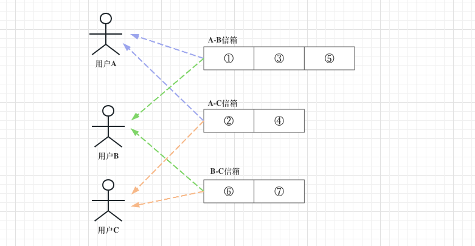
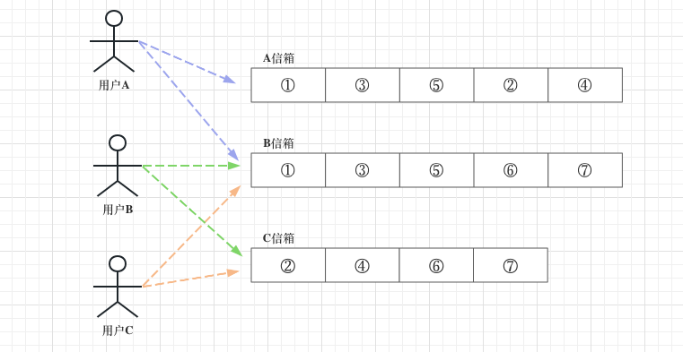
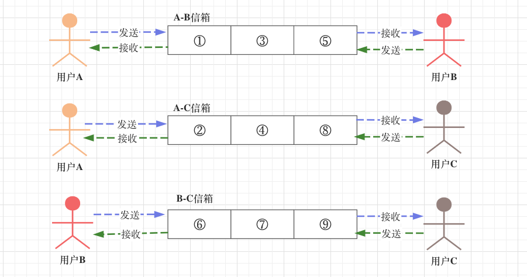
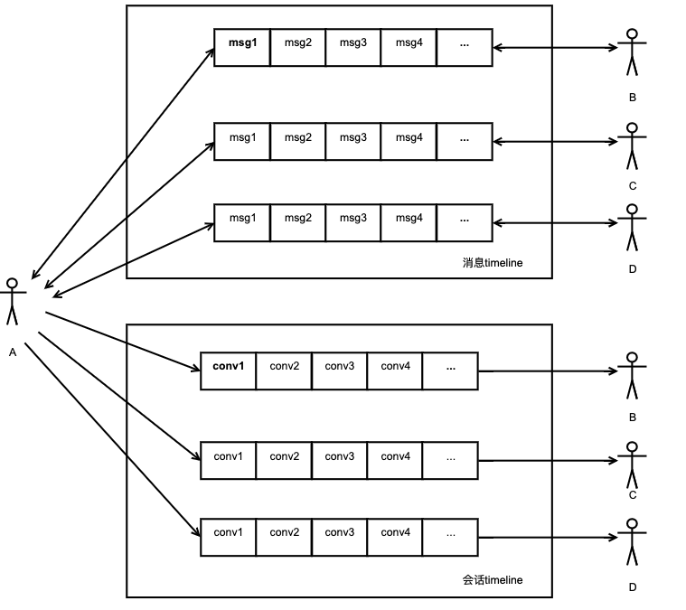
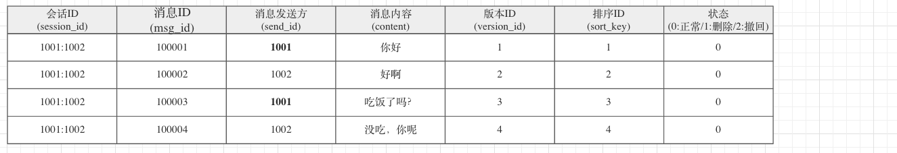
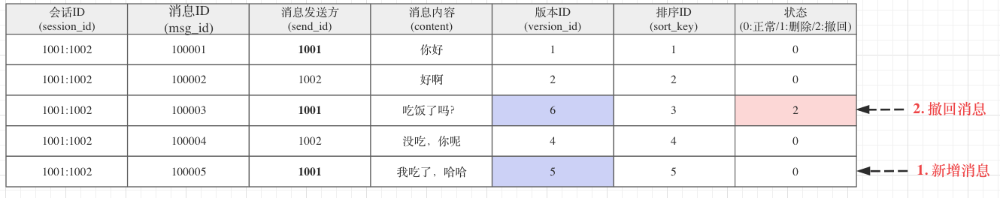

# 文档说明

- 把以前在映客的文章当作参考资料。
- 因为以前的资料很乱，这里会把私信相关的功能一个个地实现出来，然后归类到此文档。

# 参考

- 画图：https://www.processon.com/diagraming/63f48dcb26a7471f501c3cb0

各类文章参考：

- 映客的相关文档：seeklove-私信.md
- [如何设计一个亿级消息量的 IM 系统](https://xie.infoq.cn/article/19e95a78e2f5389588debfb1c) 非常好的文章。
- [揭秘！现代IM系统的消息架构如何设计？](https://zhuanlan.zhihu.com/p/64761755)
- [如何保证IM实时消息的“时序性”与“一致性”？](http://www.52im.net/thread-714-1-1.html)
- [现代IM系统中的消息系统—模型](https://help.aliyun.com/document_detail/131018.html)
- [现代IM系统中的消息系统—实现](https://help.aliyun.com/document_detail/131110.html)

# 基础知识

## 1. 获取新消息的方式

> 实际实现：基于体验和容错方面的考虑，基本都是「推拉结合」。

- [如何设计一个亿级消息量的 IM 系统](https://xie.infoq.cn/article/19e95a78e2f5389588debfb1c)

**消息更新的3种方式：**

1. **客户端<u>主动拉消息</u>**：客户端通过定时任务，定时向服务端拉取消息。
2. **服务端<u>主动推消息</u>**：服务端给客户端一个推送通知，客户端收到通知后执行拉消息的动作。
3. **推拉结合**：结合1、2两种方式，同时存在。
   - 服务端推消息，只是告诉客户端有新的消息过来。
   - 客户端收到消息后，向服务端拉取新消息（带上"上一次拉取"后，客户端记录的版本ID）
   - 为了防止消息丢失，客户端可以定时主动请求一次拉取。
     - 可以看出，使用推拉结合模式最好是用写扩散。
     - 因为写扩散只需要拉一条timeline即可，而读扩散有N条timeline，定时拉取的话性能会很差。
     - 其实也不一定，可以优化下：只有进入会话才启动定时任务，如果停留在会话列表，就不需要启动。

## 2. 读写扩散(重点)

### 2.1 参考

- [google：IM读写扩散](https://www.google.com/search?q=IM%E8%AF%BB%E5%86%99%E6%89%A9%E6%95%A3&oq=IM%E8%AF%BB%E5%86%99%E6%89%A9%E6%95%A3&aqs=chrome..69i57j0i512l3j46i10i131i433j0i10i131i433j0i512j0i10i131i433l3.5206j0j7&sourceid=chrome&ie=UTF-8)
- [从feed流认识读写扩散](https://mp.weixin.qq.com/s/yyem2O90k49IgG89r7beaA) 好文章，先从feed流去理解读写扩散更好
- [如何设计一个亿级消息量的 IM 系统](https://xie.infoq.cn/article/19e95a78e2f5389588debfb1c)

### 2.2 什么是读写扩散

通过feed流去解释读写扩散是更加好的（因为更加容易理解），而IM系统中的读写扩散就不太好理解。

- **读扩散：执行读取操作时，读取多份数据。**
- **写扩散：执行写入操作时，写入多份数据。**

---

**理解读写扩散有什么意义？**

- **认识读写扩散，是为了指导设计IM系统时，如何设计才能保证高效的读写。**
- 实际的IM系统设计，需要根据具体的业务场景进行设计。
- 一般来说，实际的业务和遇到的问题不是单一模型就能解决的。

### 2.3 timeline的设计

> 设计 timeline 的重要性

**在设计IM系统时，一定要关注timeline的设计**：

- 通信双方共享一条timeline、还是各自独享一条timeline。
- 比如：**用户A和用户B进行私信聊天。**可以使用的方案有：
  - AB共享一条timeline。
  - 还是AB各自一条timeline。
- 比如：**用户A和用户B在群组G进行聊天。**A

**总结一下设计步骤：**

1. 设计timeline，使用哪一种timeline？
2. **根据timeline的设计，看看读写操作如何执行，最后再去判断读写扩散的情况。**

### 2.4 读扩散

举个例子：

- A 向 B 发送消息：①、③、⑤
- A 向 C 发送消息：②、④
- B 向 C 发送消息：⑥、⑦

**读扩散使用的timeline：**

- **通信双方共享一条timeline。**
- **timeline存放的数据**：只会存在通信双方的数据。

**如果采用「读扩散」的方案：** 

- A-B 有一个timeline，存放的数据为：①、③、⑤
- A-C 有一个timeline，存放的数据为：②、④
- B-C 有一个timeline，存放的数据为：⑥、⑦

读写消息时：

- 写消息：通信双方，无论谁发送消息，都是往他们的共享timeline里写入消息。
- 读消息：通信双方，无论谁读取消息，都是从他们的共享timeline里读取消息。

优缺点分析：

- 优点：读写消息时，都只需要往双方共享的timeline读写即可。**这个优点对私信聊天的场景简直不要太爽。**
- 缺点：如果用户需要获取跟自己相关的timeline的所有数据，需要读取多条timeline，**这里出现了读扩散。**
  - 比如：获取所有timeline的未读消息。

### 2.5 写扩散

举个例子：

- A 向 B 发送消息：①、③、⑤
- A 向 C 发送消息：②、④
- B 向 C 发送消息：⑥、⑦

**写扩散使用的timeline：**

- **一个用户独享一条timeline。**
- **timeline存放的数据**：存在多个用户跟当前用户的通信数据。

**如果采用「写扩散」的方案：** 

- A 有一个timeline，存放的数据为：①、③、⑤、②、④
- B 有一个timeline，存放的数据为：①、③、⑤、⑥、⑦
- C 有一个timeline，存放的数据为：②、④、⑥、⑦

**读写消息时：**

- 写消息：每次写入时，需要写入到多条timeline，**这里出现了写扩散**。
  - 当用户A向用户B发送消息时，需要往A的timeline写入消息。同时，也要往B的timeline写入消息。
  - 当用户B向用户A发送消息时，需要往B的timeline写入消息。同时，也要往A的timeline写入消息。
  - 所以，对于一个用户的timeline来说，存在多个用户的消息。
- 读消息：
  - 如果读取自己跟<u>某个用户</u>的消息，因为timeline存在多用用户的消息。所以，很难做得到。
  - 如果读取自己跟<u>所有用户</u>的消息，直接读取自己timeline即可。

**优缺点分析：**

- 优点：如果读取自己跟所有用户的消息，则只需要关注自己的timeline即可。
- 缺点：每次写入操作都需要写入多份数据（写入次数多）。
- 总的来说，对于IM系统来说，使用写扩散的缺点大于优点。

# --------私信设计--------

# 1. timeline的设计

## 1.1 关注点

1. [消息更新的方式](#1. 消息更新的方式)。
2. [timeline的设计](#2.3 timeline的设计)。
3. [读写扩散](#2.2 什么是读写扩散)。

## 1.2 设计方案

**timeline的设计：**当用户A和用户B相互发消息时：

- [消息的timeline设计](#1.2.1 维护消息的timeline)：采用[读扩散](#2.4 读扩散)的方案，A和B共享一条timeline。
- [会话的timeline设计](#1.2.2 维护会话的timeline)：采用[写扩散](#2.5 写扩散)的方案，A和B独享一条timeline。

### 1.2.1 维护消息的timeline

- 写消息时：通信双方，无论谁发送消息，都是往他们<u>共享的timeline</u>里写入消息。
- 读消息时：通信双方，无论谁读取消息，都是从他们<u>共享的timeline</u>里读取消息。

### 1.2.2 维护会话的timeline

- 写消息时，双方各自独享的timeline都需要更新（他们都需要知道有新消息）。
- 写消息时，会触发会话的更新。
  - 如果收到一个新用户的消息，会插入一个会话到会话列表。
  - 如果收到一个老用户的消息，会更新会话的展示消息（展示最新一条消息到会话框）。

# 2. 数据库设计

> [IM-数据库设计.md](IM-数据库设计.md)

# 3. ID的设计

- [如何设计一个亿级消息量的 IM 系统](https://xie.infoq.cn/article/19e95a78e2f5389588debfb1c)

## 3.1 ID的设计的关注点

1、**使用什么级别的ID？**全局级别、用户级别、会话级别。

- **唯一性**：全局级别的唯一、用户级别的唯一、会话级别的唯一。
- **递增性**：全局级别的递增、用户级别的递增、会话级别的递增。
  - 全局递增：可以使用Snowflake算法。
  - 待补充。

---

2、**使用连续递增的ID，还是单调递增？**

- 连续递增，比如：1、2、3、4这种，单调递增，只需要后面的ID比前面的ID大即可，不要求连续。
- 据我所知，QQ的消息ID使用<u>会话级别</u>的<u>连续递增ID</u>。
  - 如果丢失消息，当下一条消息到达时，发现ID不连续就会去请求丢失的消息，从而避免消息丢失。

---

3、**使用数字类型的ID，还是字符类型的ID？**待补充。

## 3.2 各种ID的使用

### 3.2.1 消息ID

> 消息ID：msgId / msg_id

消息ID，[全局唯一](#3.1 ID的设计的关注点)。用于标识一条消息，作为message表的主键值。

~~~go
func GenerateMsgId(ctx context.Context, slotId uint64, currTimestamp int64) (uint64, error) {
	// 每秒一个Key，在Key上面进行+1操作
	key := getMsgIdIncrNum(currTimestamp)
	incr, err := incNum(ctx, key, 2)
	if err != nil {
		return 0, err
	}

	// msg_id的组成部分：[ 10位：相对时间戳 | 6位：自增id | 4位：槽id ]
	// 槽id的作用：使用msg_id也能定位到对应的数据库和数据表
	timeOffset := currTimestamp - baseTimeStampOffset
	idStr := fmt.Sprintf("%d%06d%04d", timeOffset, incr%1000000, slotId%10000)
	return cast.ToUint64(idStr), nil
}
~~~

### 3.2.2 会话ID

> 会话ID：sessionId / session_id

会话ID，用于标识一个会话。

- 由于私信的消息采用[读扩散](#2.4 读扩散)的形式，所以message表中，每一条消息都需要记录<u>会话ID</u>。

~~~go
// GetSessionId 获取会话id，小的uid在前，大的uid在后
func GetSessionId(uid1 uint64, uid2 uint64) string {
	smallerId, largerId := GetSortNum(uid1, uid2)

	// session_id的组成部分：[ smallerId ":" largerId]
	return fmt.Sprintf("%d:%d", smallerId, largerId)
}
~~~

### 3.2.3 版本ID

> 版本ID：versionId / version_id

#### 3.2.3.1 版本ID的说明(重点)

**版本ID的说明：**

- **contact表和message表都存在版本ID。**
  - 对于contact表来说，版本ID属于[用户级别唯一](#3.1 ID的设计的关注点)。
  - 对于message表来说，版本ID属于[会话级别唯一](#3.1 ID的设计的关注点)。
- **版本ID用于拉取改变：**
  - 如果用户停留在会话列表，会利用contact表的version_id，拉取联系人列表。
  - 如果用户停留在消息列表（聊天框），会利用message表的version_id，拉取消息列表。
- **拉取时机：**拉取时，都是使用客户端本地记录的**最大version_id**。
  - 停留在聊天框时：
    - 收到新消息Push，拉取消息列表。
    - 定时任务，拉取消息列表。
  - 停留在会话列表时：
    - 收到新消息Push，拉取会话列表。
    - 定时任务，拉取会话列表（确认某个会话框是否有新消息）。
  - 退出聊天框后，拉取一次联系人列表。

#### 3.2.3.2 两个最后ID的说明(重点)

1、**最后的消息ID**：lastMsgId / last_msg_id。

- 双方聊天记录中，最新一条消息的消息ID。

2、**最后删除的消息ID**：lastDelMsgId / last_del_msg_id。

- 删除联系人、清空聊天记录时，都会更新它的值。
- 更新值时，会从数据库拿到的last_msg_id，然后赋值给last_del_msg_id。

#### 3.2.3.2 版本ID的值变化

**1、用户1001和用户1002进行聊天通信：**

- 此时，两个用户的客户端本地数据库记录的**最大的version_id**为4。

2、**用户执行了两个操作：**

1. 发送了一条新消息，消息ID为100005，version_id为5。
2. 撤回了一条消息，消息ID为100003，原本的version_id为3，撤回消息后改为6。

3、**当用户1002拉取新消息时：**

- 他会把本地数据库记录的最大version_id等于4，传到服务端进行消息拉取。
- 服务端会把version_id大于4的消息都返回给用户。
- 最后，得到了两条消息：一条属于新增消息，一条属于撤回消息，客户端进行对应的消息更新。
  - 新增消息：把消息插入到消息聊天记录。
  - 撤回消息：把原本的消息内容改为"对方已撤销消息"。

#### 3.2.3.3 使用版本ID增量拉取消息(重点)

> https://www.processon.com/diagraming/63f48dcb26a7471f501c3cb0

1. 用户1001，执行了清空聊天记录的操作。所以，contact表中的last_del_msg_id被更新。
   - 拉取消息时，因为last_del_msg_id=100002，所以拉取到消息ID必须必须大于 last_del_msg_id。
2. 当前客户端本地记录的**最大version_id**为5。
3. **如果执行<u>拉旧操作</u>：**拉取最新消息。用户向下翻页会主动触发拉旧（本地缓存过期，没过期不会调服务端）。
   - 返回两条消息，消息ID为：100003、100004。
4. **如果执行<u>拉新操作</u>：**拉取历史消息。用户向上翻页会主动触发拉新。
   - 返回两条消息，消息ID为：100006、100007。

#### 3.2.3.4  版本ID和排序ID的区别

**sort_key与version_id有什么区别？**

- 在生成消息的时候，**[sort_key](#3.2.4 排序ID)**和**version_id**的值是一样的。
- 删除和撤销消息只会修改version_id，不会修改sort_key。

#### 3.2.3.5 利用版本ID实现多设备同步

**如何解决多设备同步的问题？**

- 有新消息的时候，不仅会通知<u>消息接收方</u>，同时也会通知<u>消息发送方</u>。
- 通过消息发送方后，消息发送方也会拉取消息，从而实现多设备同步。

### 3.2.4 排序ID

> 排序ID：sortKey / sort_key

#### 3.2.4.1 排序ID的值变化

> contact 和 message表 都有排序ID。

1. sort_key的初始值等同于version_id。
2. contact表：sort_key用于让客户端对会话列表执行排序操作。
   - 用户执行<u>置顶操作</u>，会修改sort_key的值。
3. message表：sort_key用于让客户端对消息列表执行排序操作。

### 3.2.5 本地序列ID

> 本地序列ID：seqId / seq_id

客户端本地数据库的消息ID，用来对消息进行唯一标识。

发送消息时：

- 客户端：先给消息生成一个seq_id（一般为毫秒级时间戳），然后，将消息存储于本地的数据库。
- 客户端：调用服务端的私信发送接口，然后将服务端返回的该消息的相关ID更新入数据库。
- 拉取消息、拉取联系人列表的操作都是在处理完展示逻辑后，把从服务端拉取到数据存入本地数据库，然后与本地数据进行合并，以便离线时从本地拉取数据。

---

其实，目前来说，还没有看到用途。

# 4. 消息保证

- [如何设计一个亿级消息量的 IM 系统](https://xie.infoq.cn/article/19e95a78e2f5389588debfb1c)

## 4.1 消息丢失

**什么情况下会出现消息丢失？**

- 发送消息后，通过长链接消息告诉对方有新消息时，长链接消息丢失了。

---

**如何防止消息丢失？**根据[获取新消息方式](#1. 获取新消息的方式)的不同，会有不同的方法。

- **如果采用推拉结合：**
  - **方法1：使用定时任务，定期拉取新消息。**
    - 注意：用户进入某个会话时，才启动定时任务。如果停留在会话列表，则不需要启动定时任务。
  - 方法2：每次重新进入会话列表 或者 从某个会话回退到会话列表，都进行一次新消息拉取。
- **如果采用服务端主动推的方式：**
  - 方法1：使用[QQ的方案](#3.1 ID的设计的关注点)，消息ID使用<u>会话级别</u>的<u>连续递增ID</u>，能很好地判断消息是否有空洞。
  - 方法2：每条推送的消息，带上"上一条消息"的消息ID，让客户端判断是否存在消息丢失。
  - 方法3：保证最终成功：需要不断重试，保证消息最终能够到达对方。
  - 方法4：**使用推拉结合的前两个方法。**

## 4.2 消息实时

待补充。

## 4.3 消息顺序

待补充。

# 5. 消息撤回和删除

# 6. 消息已读

# 7. 消息未读数

单个会话的未读数

所有会话的未读数

# 目前方案存在的问题

1. 数据库操作很慢，需要引入缓冲。
   - 引入缓存后，如何保证数据库与缓冲的一致性（最终一致性）。
   - 引入缓存后，如果采用CacheAside模式，因为写入需求特别大，所以缓存的命中率不高。
2. 待补充

# --------系统设计--------

实现源码参考：

- https://github.com/OpenIMSDK/Open-IM-Server     [官网](https://doc.rentsoft.cn/#/introduce/production_introduce)
- https://github.com/Terry-Mao/goim
- https://github.com/tinode/chat
- https://github.com/alberliu/gim
- https://github.com/matyhtf/php-webim

# --------WebSocket--------

- https://github.com/halfrost/Halfrost-Field/blob/master/contents/Protocol/WebSocket.md
- https://en.wikipedia.org/wiki/WebSocket
- https://datatracker.ietf.org/doc/html/rfc6455

# overview

The handshake from the client looks as follows:

~~~
GET /chat HTTP/1.1
Host: server.example.com
Upgrade: websocket
Connection: Upgrade
Sec-WebSocket-Key: dGhlIHNhbXBsZSBub25jZQ==
Origin: http://example.com
Sec-WebSocket-Protocol: chat, superchat
Sec-WebSocket-Version: 13
~~~

 The handshake from the server looks as follows:

~~~
HTTP/1.1 101 Switching Protocols
Upgrade: websocket
Connection: Upgrade
Sec-WebSocket-Accept: s3pPLMBiTxaQ9kYGzzhZRbK+xOo=
Sec-WebSocket-Protocol: chat
~~~

# 客户端

- PHP：https://www.kancloud.cn/zhixunjie/swoole_websocket/363058

# 服务端

第三方API：

- https://pkg.go.dev/nhooyr.io/websocket

RFC：

- https://datatracker.ietf.org/doc/html/rfc6455#section-5.2
- https://datatracker.ietf.org/doc/html/rfc6455#section-1.3

~~~
0                   1                   2                   3
0 1 2 3 4 5 6 7 8 9 0 1 2 3 4 5 6 7 8 9 0 1 2 3 4 5 6 7 8 9 0 1
+-+-+-+-+-------+-+-------------+-------------------------------+
|F|R|R|R| opcode|M| Payload len |    Extended payload length    |
|I|S|S|S|  (4)  |A|     (7)     |             (16/64)           |
|N|V|V|V|       |S|             |   (if payload len==126/127)   |
| |1|2|3|       |K|             |                               |
+-+-+-+-+-------+-+-------------+ - - - - - - - - - - - - - - - +
|     Extended payload length continued, if payload len == 127  |
+ - - - - - - - - - - - - - - - +-------------------------------+
|                               |Masking-key, if MASK set to 1  |
+-------------------------------+-------------------------------+
| Masking-key (continued)       |          Payload Data         |
+-------------------------------- - - - - - - - - - - - - - - - +
:                     Payload Data continued ...                :
+ - - - - - - - - - - - - - - - - - - - - - - - - - - - - - - - +
|                     Payload Data continued ...                |
+---------------------------------------------------------------+
~~~

